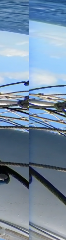

# insv-to-yt

Convert Insta360 `.insv` videos to `.mp4` that can be uploaded to youtube as 360
video.

Insta360 videos are `.insv` files which are `.mp4` in fisheye format. You need 2
files to reconstruct the full 360 degree range.

Youtube requires a `.mp4` with custom metadata in an equirectangular projection.

We therefore need to:

1. Strip the trailer data from the `.insv` file and rename to `.mp4`
2. Join the 2 files side by side as dual fisheye.
3. Remap each frame to equirectangular.
4. Add the custom youtube metadata.

Out of scope for the moment:

- Reprojecting the focus of the video.
- Stabilisation, or any post processing

# Using FFMpeg

The most obvious approach would be to use the out of the box filters from
ffmpeg. ie:

```sh

# Join videos side by side
ffmpeg -i $VIDEO1 -i $VIDEO2 \
  -filter_complex "[0:v][1:v]hstack=inputs=2[v]; [0:a][1:a]amerge[a]" \
  -map "[v]" -map "[a]" \
  -ac 2 intermediate.mp4

# Remap to equirectangular
ffmpeg -i intermediate.mp4 -vf v360=dfisheye:e:yaw=-90 intermediate2.mp4

# Use youtube cli to add metadata
python spatialmedia -i intermediate2.mp4 output.mp3

```

This works, however the concatenation of the videos leaves a nasty visible join
between the two 180 videos.



